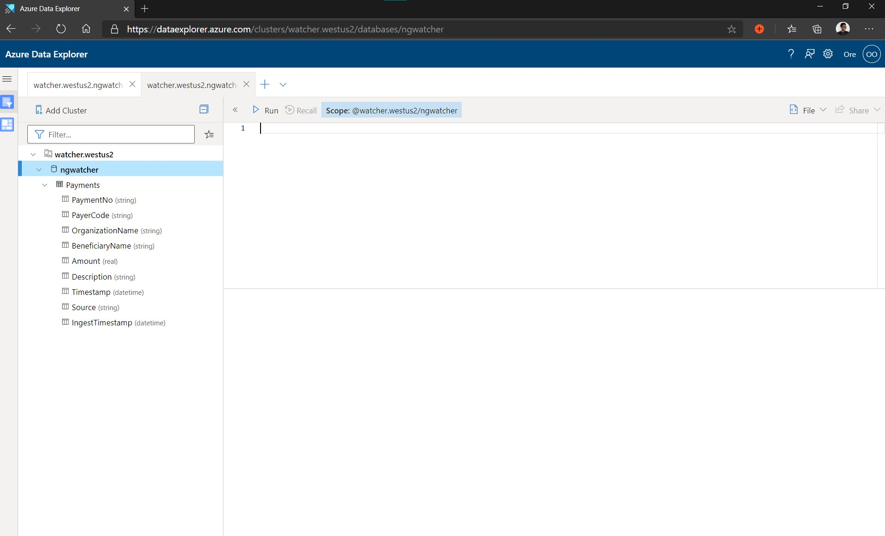

# Watcher
This service will analyze data from [Nigeria's Open Treasury](https://opentreasury.gov.ng) and discover insights across different verticals

## What questions do we need answered by the data
1. What is the government spending the most on (monthly, weekly)
    - What Organizations
    - What beneificaries
    - What grouping does this spending belong to (infra, defence etc.)

2. How is spending looking wrt to budget?

3. (more questions from contributors & interested public)

## Architecture flow
1. Fetch Data from source:
    - Powershell script to get data in xlsx from open treasury source (see `./ingestion/FetchDaily-Data.ps1`)
        - This currently runs once but when deployed will be run on a daily basis ( and also attempt to get missing data )

2. Preprocess & write all records into a queryable data store ( see `./ingestion/kustoingest.py`])
    - Python Script to parse through existing excel records in the `./ingestion/data` directory and feed them into an Azure Data Explorer (Kusto) database.
        - This currently runs once but when deployed will be run automatically right after the data fetch from the source

3. Present answers to questions in an easy to understand way
    - Jupyter notebook writing queries and visualizations answering questions
    - Embed notebook into a website
        - Will need to create a new app registration that will authenticate against with Kusto & run queries on behalf of public website
            - Kusto caching dey so we dey alright, no fancy stuff needed on the frontend for the most part 

## Getting access to the processed data & sample queries
Pre-processed data is stored in Azure Data Explorer. Access is currently granted manually by [@orehga](https://github.com/orehga). Please open a new issue sharing the email address that is linked to your microsoft account. It's a work item on the roadmap to have this process automated.

- [Go to watcher data explorer](https://dataexplorer.azure.com/clusters/watcher.westus2/databases/ngwatcher) 

    Here's a screenshot of what you should see: 

- Sample Queries
    - [10 random payments from the federal government this year](https://dataexplorer.azure.com/clusters/watcher.westus2/databases/ngwatcher?query=H4sIAAAAAAAAAwtIrMxNzSsp5qpRKM9ILUpVCMnMTS0uScwtULBTANJFJflplamJRRp5+eUamppwZcH5pUXJqQq2tgpKbu5+SkDxksTsVAVDAwClFTloUQAAAA==)
    - [Top organizations the government has spent on this year](https://dataexplorer.azure.com/clusters/watcher.westus2/databases/ngwatcher?query=H4sIAAAAAAAAAz2LPQvCMBCGd3/F0SkBJ/cWXHSrgu5ybU7NcDm5JJQUf7wngtP79bxnbEyp5M0blicpwTUy5YL8ggFMtci9EapLsjjv/9hFqs4EfQ/d4Th21ufKjBpXApWagrPs9my2+C3sPEwNTvrAFFcsUdKITPYSDaTfzfDbD4dAef4Awfzx/pgAAAA=)

## Data Structure 
Database: `ngwatcher`

Tables:
- `Payments`
    - Schema: 
        - `PaymentNo` - (string) Identifier for the payment
        - `PayerCode` - (string) Identifier for the payer
        - `OrganizationName` - (string) Name of the organization the payment went to e.g "NATIONAL INLAND WATERWAYS AUTHORITY"
        - `BeneficiaryName` - (string) Name of the beneficiary in the organization. Looking a different entries in payment records, granularity varies based on the size of the organzation. Value can be any of the following:
            - Name of the sub-organization with the `OrganizationName` e.g "FEDERAL INLAND REVENUE SERVICES"
            - Name of a person in the `OrganizationName`
            - or just the same value as `OrganizationName`
        - `Amount` - (real) Amount in Nigerian Naira that was paid.
        - `Description` - (string) Text to provide more context on the purpose of the payment
        - `Timestamp` - (datetime) Day that payment occured
        - `Source` - (string) Describing where the payment entry is originated. Values can be any of the following:
            - `FGN` - "Federal Government of Nigeria" or 
            - `MDA` - "Ministries, Departments and Agencies"
        - `IngestTimestamp` - (datetime) Timestamp for when ingestion into database occured

## Todos
- Inference from data:
    - How do we actually validate if the payments were spent on the reight things

- Data ingestion pipeline
    - More preprocessing on data
        - how do we prevent duplicate entries in future day records
    - Deploy & Automate data fetch, pre-process and import process

- 2nd level analysis will be done on extracted data for anomaly detection on patterns
    - Twitter bot with fire alert
        - alert will contain (rough overview)
        - link to dashboard vis that represents anomaly

(relegating as this can be part of a v2 effort)
- Fetch more payment data from other sources
    - currently we fetch data for `FGN - Federal Government of Nigeria` but we also need to do the same for the `MDAs - Ministries, Departments and Agencies` ( this data source doesn't look well populated at the moment)